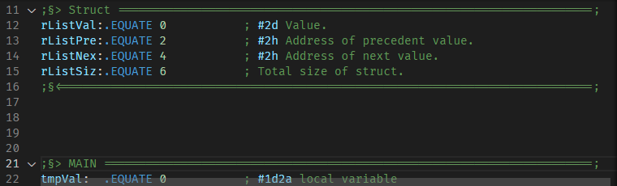

# Pep/8 Assembly Language Extension

Language support for the Pep/8 assembly language.

This project is based on the [Pep/9 Assembly Language Extension](https://github.com/icorbrey/pep9-asm/) made by Isaac Corbrey ([icorbrey on GitHub](https://github.com/icorbrey/)), and on the [Pep Highlighter](https://github.com/StanWarford/pep8/blob/master/pephighlighter.cpp) regex's from the PEP/8 software, made by Stan Warford himself ([StanWarford on GitHub](https://github.com/StanWarford/)).

It mainly consists of only a few modifications to support the differences in Pep/8 mnemonics and directives.
Here is a non-exhaustive list of additions and modifications to pep9:
- `CHARI` and `CHARO` highlighting added.
- `RET0` to `RET7` highlighting added.
- Trace tags (in comments) highlighting added.
- Symbols highlighting corrected.
- Memory instructions (`LDr`, `LDBYTEr`, `STr`, `STBYTEr`) corrected.
- Traps instructions highlighting betterized.
- Etc.

## Features

- Adds basic language support to Visual Studio Code for the Pep/8 assembly language (**still** 🤷‍♂️) used in (**some**) Computer Systems college courses.

- Adds folding markers as comments to make long code easier to read. How to use them :
    - **Start**: use these exact symbols `;§>` in a comment that starts at the **beginning** of a line. You can then add any other character as in a normal comment.
    - **End**: use these exact symbols `;§<` in a comment that starts at the **beginning** of a line. You can then add any other character as in a normal comment.

    A start marker without a corresponding end marker will not allow code folding in Visual Studio Code.

    Unfolded :

    

    Folded :

    

    You can edit them directly in the source code of the extension which is located in the Visual Studio Code user folder (`C:\Users\<yourUserName>\.vscode\extensions\deagrut.pep8-asm-X.X.X > folding{} > markers {}` for Windows, please refer to the official documentation for other OS's), but any update for this extension will erase these personnalization due to the structure of Language Support extensions.
    

## Release Notes

See [CHANGELOG.md](https://github.com/deagrut/pep8-asm/blob/main/CHANGELOG.md) for release notes.
